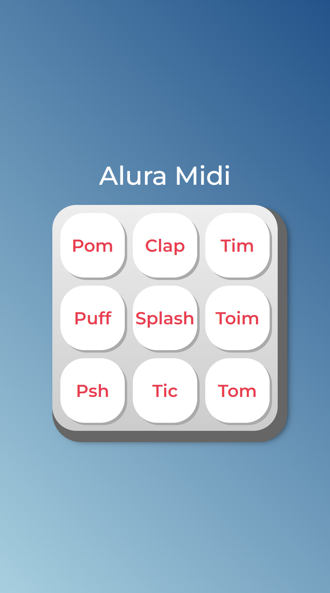

<h1 align="center"> Aluramid </h1>

  

## 🚀 Tecnologias

Esse projeto foi desenvolvido com as seguintes tecnologias:

- HTML, CSS e JAVASCRIPT
- Git e Github

## 💻 Projeto

O aluramid é uma plataforma de Som desenvolvida usando lógica de JavaScript.

- [Acesse o projeto finalizado, online](https://ramonwordads.github.io/aluramidi)
